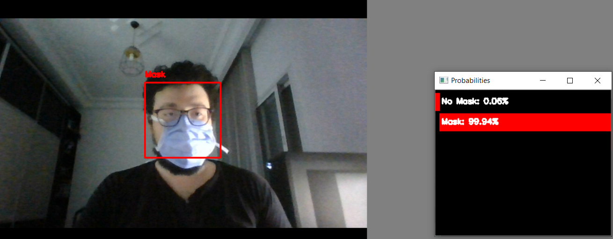
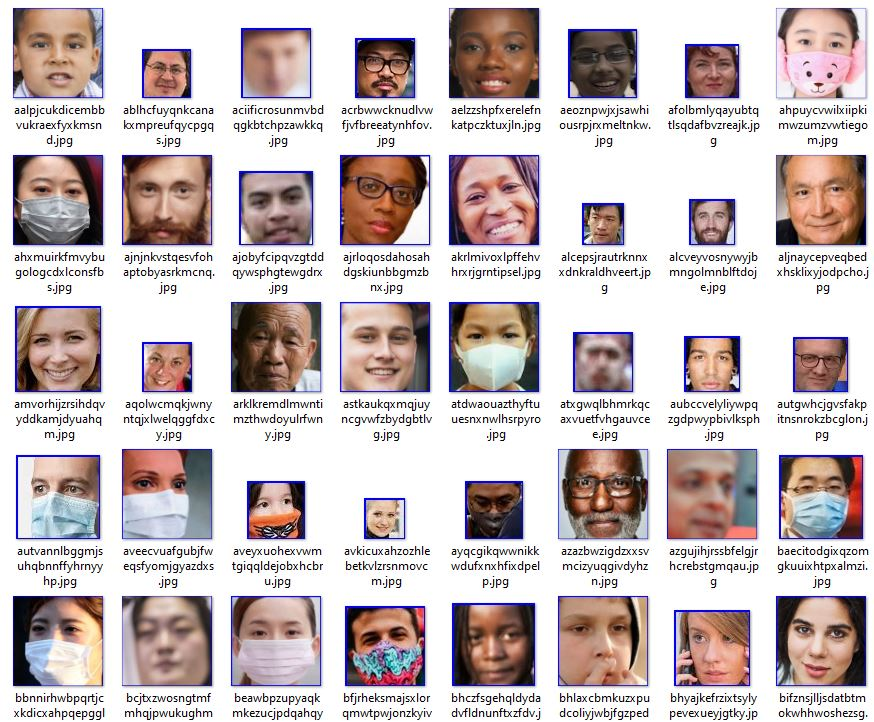

# Mask detection
The dataset was provided during [**Spot the Mask Challenge by #ZindiWeekendz**](https://zindi.africa/hackathons/spot-the-mask-challenge).  
  
  In this repo we will use the entire dataset in our favor (I did use the results of a privously trained model on the training part to label the unlabelled images + some manual corrections there was arround 10 wrong predictions out of 510 validation images).  
  ## Objectif 
  Creating an AI model capable of predicting in real time if the person in the camera frame is wearing a mask.  
    
    
    
## Image cropping  

    
We will be using OpenCV's Haarcascade precisely the frontal face detection.  
```Python
face_cascade = cv2.CascadeClassifier('cascades/data/haarcascade_frontalface_alt2.xml')

picture_folder = ".."
target_folder = ".."
all_images = os.listdir(picture_folder)

for item in tqdm(all_images) :
    img = cv2.imread(picture_folder + item)
    gray = cv2.cvtColor(img, cv2.COLOR_BGR2GRAY)
    faces = face_cascade.detectMultiScale(gray, 1.05, 1)
    for (x,y,w,h) in faces:
        img = cv2.rectangle(img,(x,y),(x+w,y+h),(255,0,0),2)
        roi_gray = gray[y:y+h, x:x+w]
        roi_color = img[y:y+h, x:x+w]
        eyes = eye_cascade.detectMultiScale(roi_gray)
        cv2.imwrite(target_folder + item, roi_color)
```  
This will allow us to obtain cropped images, but not all images will get cropped try tweaking the **detectMultiScale** parameters to obtain better results.  
I also did some manual cropping to have more samples but still the number of images obtained was relatively small (~1000 images for both categories).  
Here's sample of the outcome :  
  

    
## Spliting the data by category  
```Python
data = pd.read_csv("train_labels.csv")

pictures_folder = ".."
target = ".."

#puting every picture in its associated class folder
for item in tqdm(range(0, data.shape[0])):
    try :
        picture_name = data['image'][item]
        l = picture_name.split('.')
        picture = Image.open(pictures_folder  + l[0]+'.png')
        picture_class = data['target'][item]
        picture.save(target + str(picture_class) + '/' + l[0]+'.png')
    except :
        print('bug')
```  
## Data augmentation 
```Python
def augment_data(label_path):
	label = label_path.split('/')[-1]
	if label == "0":
		files = os.listdir(label_path)
		for file in files:
			file_name = file.split(".")[0]
			file_ext = file.split(".")[1]
			img = Image.open(label_path + "/" + file)
			img_rotate_120 = img.rotate(120)
			img_rotate_120.save(label_path + "/" + file_name + "rotate_120." + file_ext)
			img_enhance = img.filter(ImageFilter.EDGE_ENHANCE())
			img_edge = img.filter(ImageFilter.FIND_EDGES())
			img_enhance.save(label_path + "/" + file_name + "enhance." + file_ext)
			img_edge.save(label_path + "/" + file_name + "edge." + file_ext)
	if label == "1":
		files = os.listdir(label_path)
		for file in files:
			file_name = file.split(".")[0]
			file_ext = file.split(".")[1]
			img = Image.open(label_path + "/" + file)
			img_rotate_120 = img.rotate(120)
			img_rotate_120.save(label_path + "/" + file_name + "rotate_120." + file_ext)
			img_enhance = img.filter(ImageFilter.EDGE_ENHANCE())
			img_edge = img.filter(ImageFilter.FIND_EDGES())
			img_enhance.save(label_path + "/" + file_name + "enhance." + file_ext)
			img_edge.save(label_path + "/" + file_name + "edge." + file_ext)

for label in labels:
	print("augmenting data in ", label)
	label_path = ".." + label
	try:
		augment_data(label_path)
	except:
		print("bug in ", label)
```
## Model creation 
Due to the limitation in the size of the data we have it would be ideal to use pre-trained models like ResNET50, but even simple and barely trained CNN neural network can get you decent results. But still transfer learning is highly reccomended for this I'm going to refer you to the [**Winning solution by Adem**](https://github.com/Bouguedra-Adem/Spot-the-Mask-Challenge-by_ZindiWeekendz?fbclid=IwAR1Y6mPF-wdvMu6m0gTPVrqc1D6h8waYauSRDownRQ9hzG2xdswNzXb8X9A).  
Simple CNN architecture :  
```Python  
classifier = Sequential()

classifier.add(Conv2D(64, (3, 3), input_shape=(112, 112, 3), activation='relu'))
classifier.add(MaxPooling2D(pool_size=(2, 2)))
classifier.add(BatchNormalization())


classifier.add(Conv2D(128, (3, 3), activation='relu'))
classifier.add(MaxPooling2D(pool_size=(2, 2)))
classifier.add(BatchNormalization())


classifier.add(Conv2D(256, (3, 3), activation='relu'))
classifier.add(MaxPooling2D(pool_size=(2, 2)))
classifier.add(BatchNormalization())


classifier.add(Flatten())
classifier.add(Dense(units=512, activation='relu'))
classifier.add(Dropout(rate=0.2))

classifier.add(Dense(units=256, activation='relu'))
classifier.add(Dropout(rate=0.2))

classifier.add(Dense(units=128, activation='relu'))
classifier.add(Dropout(rate=0.2))

classifier.add(Dense(units=64, activation='relu'))
classifier.add(Dropout(rate=0.2))

classifier.add(Dense(units=32, activation='relu'))
classifier.add(Dropout(rate=0.2))

classifier.add(Dense(units=16, activation='relu'))
classifier.add(Dropout(rate=0.2))

classifier.add(Dense(units=2, activation='softmax'))

classifier.compile(optimizer='adam', loss='categorical_crossentropy', metrics=['accuracy'])
```
## Simple implementation using OpenCV  
  
All the code used is available in the utils folder.
